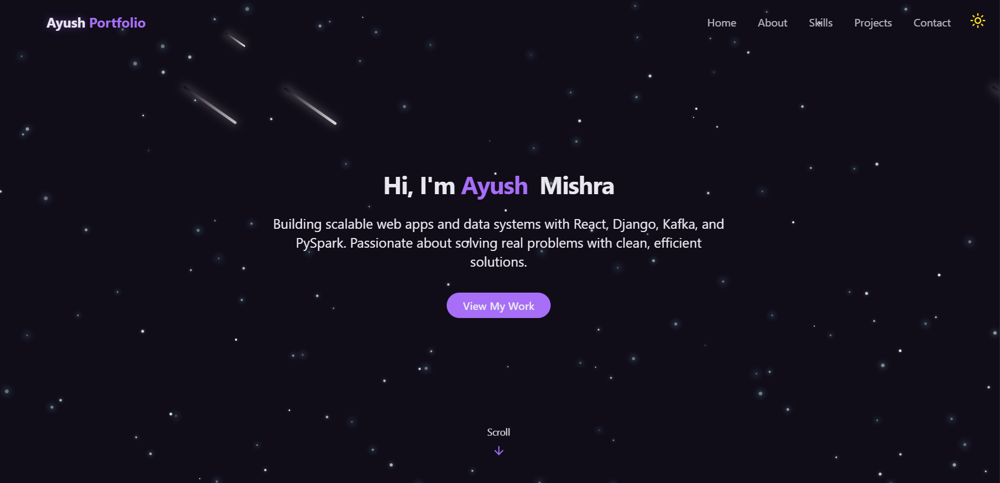

# 🚀 Personal Portfolio

<p align="center">
  
</p>

---

## About

This is my personal portfolio website built with React and styled using Tailwind CSS.  
It showcases my projects, skills, and contact information in a clean, responsive, and user-friendly design.  

---

## Features

- ✨ **Responsive Layout:** Looks great on desktop, tablet, and mobile devices  
- 🚀 **Fast & Lightweight:** Optimized React frontend with Tailwind for rapid styling  
- 💡 **Interactive UI:** Smooth navigation and engaging project displays  
- 📱 **Contact Section:** Easy way to get in touch via email or social links

---

## Technologies

- ⚛️ React.js  
- 🎨 Tailwind CSS  
- 🖥️ Vite (or Create React App, replace if needed) for development environment  
- 📦 npm for package management

---

## Installation & Usage

To run the portfolio locally, follow these steps:

```bash
# Clone the repository
git clone https://github.com/AyushColas/Portfolio.git

# Navigate into the project directory
cd Portfolio

# Install dependencies
npm install

# Start the development server
npm start
